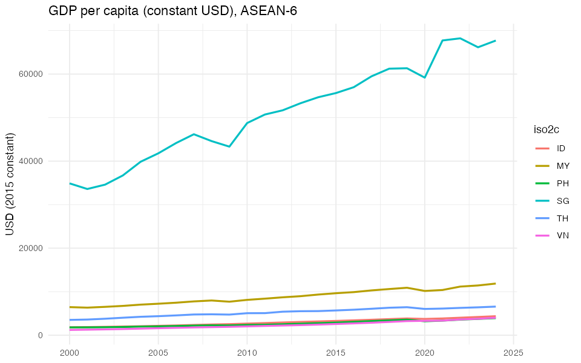
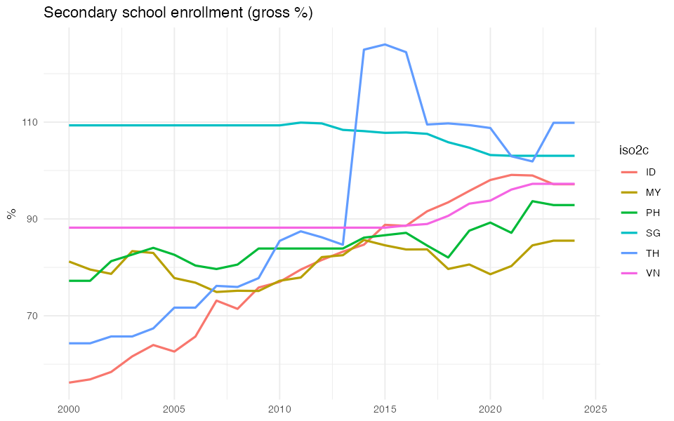
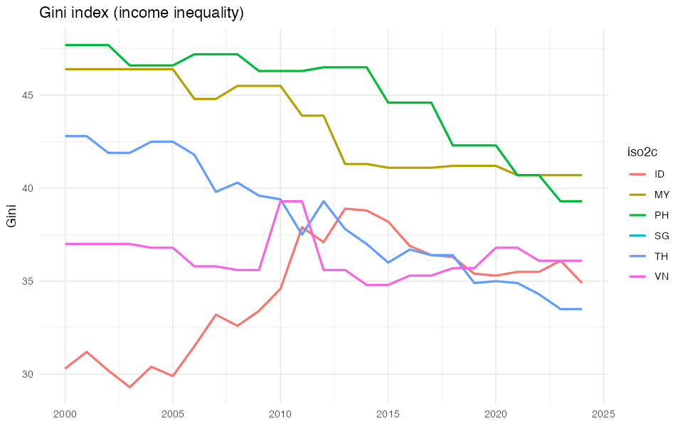

# Education, GDP, and Inequality Panel Dataset

## Overview
This project collects, cleans, and analyzes household- and country-level panel data for six ASEAN countries.  
The focus is on the relationships between **education**, **GDP per capita**, and **income inequality**.

## Project Structure
## How to Run
1. Clone the repository:
   ```bash
   git clone https://github.com/your-username/edu-gdp-inequality-panel.git

## Figures



