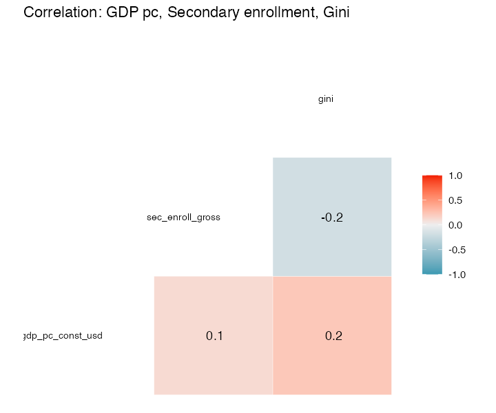
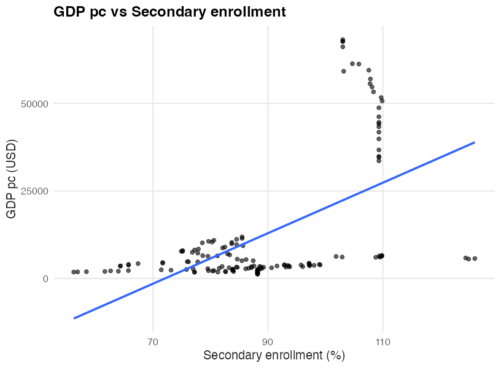
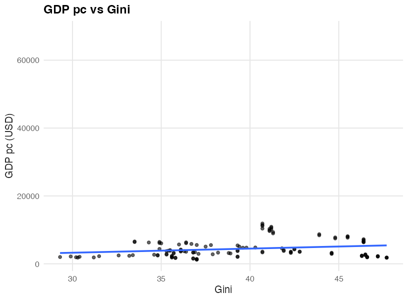
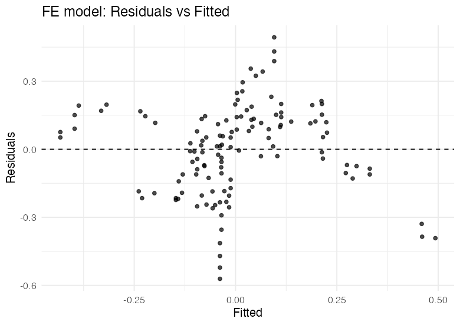
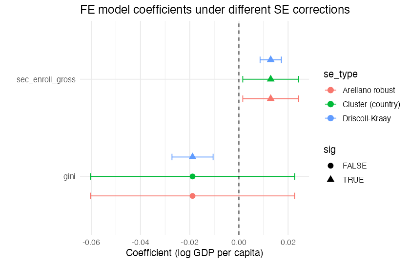

# Education, GDP, and Inequality Panel Dataset

## Overview
This project collects, cleans, and analyzes household- and country-level panel data for six ASEAN countries.  
The focus is on the relationships between **education**, **GDP per capita**, and **income inequality**.

## Project Structure
## How to Run
1. Clone the repository:
   ```bash
   git clone https://github.com/hanynavarra/edu-gdp-inequality-panel.git

## Figures


## Panel Summary
See `reports/panel_summary.md` for missingness and balanced-years info.

## Figures






## Diagnostics
See `reports/diagnostics.md` for:
- Unit roots (IPS)
- Multicollinearity (VIF)
- Cross-sectional dependence (Pesaran CD)
- Serial correlation (panel BG)
- Heteroskedasticity (Breusch–Pagan)



## Fixed-Effects Regression
We estimated a country FE model:

log(GDP per capita) ~ Secondary enrollment + Gini

- Three SE corrections: Clustered, Arellano, Driscoll–Kraay  
- See `reports/fe_model.md` for details



## Robustness
See `reports/model_robustness.md` for:
- Coefficients across Pooled / FE / Two-way FE / RE
- LM test (RE vs pooled), Hausman (FE vs RE)
- F-tests for country and time fixed effects

## Figures


---

## Discussion of Results  

Our panel dataset of six ASEAN countries (2010–2024) shows:  

- **GDP per capita and enrollment** move closely together, indicating that higher economic growth is associated with improved access to education.  
- **GDP per capita and inequality (Gini index)** show weaker correlation, suggesting that growth does not automatically reduce inequality.  
- **Fixed Effects estimation** confirms that, within countries, increases in GDP per capita are significantly associated with higher school enrollment rates, even after accounting for unobserved country-level differences.  
- However, the link between GDP and inequality remains mixed, hinting that redistribution policies may be necessary for growth to translate into more equitable outcomes.  

These results demonstrate how household and country-level panel data can be harmonized and analyzed to uncover meaningful relationships in development economics.  
